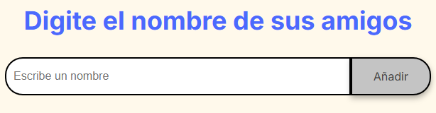
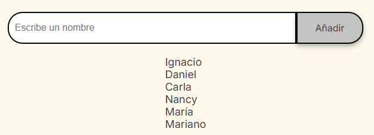
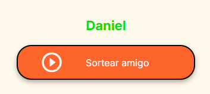

<h1>Amigo Secreto</h1>

- Descripción general

Se debe ingresar el nombre de un amigo en el campo disponible y presionando en el botón **añadir**  se iran agragando a una lista uno a uno, una vez completa la lista se debe presionar en el botón **Sortear amigo** para asi poder seleccionar un amigo de la lista el cual sera el amigo secreto.

- Guia con imagenes del funcionamiento

  * Ingresar amigo:

  </img>

  Luego de ingresar el nombre se presiona en el bóton añadir.

  * Lista de amigos:

  Luego de ingresar los amigos deseados la lista quedará lista para realizar el sorteo.
  
   </img>

   * Sorteo del amigo secreto:

  </img>

  Una vez que se presiona en el botón Sortear amigo el sistema nos dirá el amigo secreto y limpiara la lista.

     
  
    
